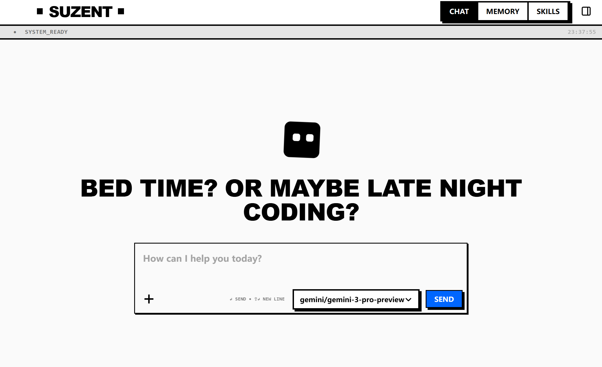

<div align="center">


# **SUZENT: YOUR SOVEREIGN DIGITAL CO-WORKER**

 

[](https://github.com/cyzus/suzent/releases) [](LICENSE) [](https://python.org)


**[QUICKSTART](docs/01-getting-started/quickstart.md)** • **[DOCS](docs/README.md)** • **[CONTRIBUTING](./CONTRIBUTING.md)**


</div>

---

##  **THE PHILOSOPHY**

> Your data. Your machine. Your rules.

SUZENT [soo-zuh-nt] combines SUZERAIN (sovereign) + AGENT (executor)—an automated system that answers to one authority: you. Built on the principles of digital sovereignty and open inspiration.


---

## **WHY SUZENT?**

SUZENT is an open-source deep research and co-worker agent that synthesizes ideas from leading AI products and projects—designed both as a fully functional tool you can use immediately and as inspiration for developers building their own agents. It demonstrates production-ready patterns for workspace management, local-first architecture, memory system, and agentic workflows, giving you a working reference implementation to learn from or extend.


## **FEATURES**

###  **MODEL AGNOSTIC**

**SUZENT** is model agnostic. It can use any model (GPT, Claude, Gemini, DeepSeek, etc.) you want.

###  **AGENTIC WORKFLOW**

**SUZENT** is a functionally rich agent that provides an experience comparable to OpenAI/Google Deep Research, Manus, and Claude Cowork — but fully open-source and locally runnable.

###  **TOOLS & SKILLS**

**SUZENT** provides simple but powerful tools for you to get started. It includes `bash`, `web search`, `web fetch`, and a series of file operations tools. These tools could guarantee you a competitive enough performance on GAIA benchmark.

You can create your custom tools and further connect to Google Drive, GitHub, or Slack via standard MCP protocol.

Agent skills are fully supported. Load your favorite skills to `./skills` folder to make **SUZENT** even more powerful.

###  **WORKSPACE**

Unlike most agents, **SUZENT** features dual workspaces: a cross-session workspace shared across all chats for persistent knowledge, and per-session workspaces for individual conversations. This enables both continuity and isolation. You can also mount local folders (like your Obsidian vault) directly into the system.

###  **MEMORY**

**SUZENT** implements a global memory system that persists across sessions. This allows you to accumulate knowledge and context across conversations, making it easier to maintain a consistent and coherent conversation history.

###  **AUTOMATION**

**SUZENT** supports two independent automation systems for proactive, scheduled agent execution:
- **Cron Jobs** — Schedule prompts to run on any cron expression in isolated sessions. Full CRUD via the Settings UI, CLI (`suzent cron`), and REST API.
- **Heartbeat** — Periodic ambient monitoring that reads a checklist from your shared workspace and notifies you only when something needs attention.

Both systems run with full memory enabled, so the agent retains context across scheduled tasks.

###  **SOCIAL INTEGRATIONS**

**SUZENT** connects to your messaging platforms so you can interact with your agent wherever you already communicate:
- **Telegram** — Chat with your agent via a Telegram bot.
- **Slack** — Integrate as a Slack app in your workspace.
- **Discord** — Run as a Discord bot in your server.
- **Lark (Feishu)** — Connect via the Lark Open Platform.

###  **PRIVATE & LOCAL**

**SUZENT** runs entirely on your device with privacy-focused web search, LanceDB for local vector storage, and MicroSandbox isolation for safe code execution. Your data never leaves your machine.

###  **UI READY**

**SUZENT** features a NeoBrutalist web interface that transforms terminal-based agent interactions into a modern, aesthetically distinct experience—combining powerful functionality with bold visual design for your digital sovereign co-worker.


*Clean, bold, and ready to work—your sovereign co-worker's command center.*

---

## **QUICK START**

### **NATIVE SETUP (RECOMMENDED)**
 
 The fastest path to getting started. Requires **Git** and **Node.js 20+**.
 
 ```bash
 # WINDOWS (PowerShell)
 powershell -c "irm https://raw.githubusercontent.com/cyzus/suzent/main/scripts/setup.ps1 | iex"
 
 # MAC / LINUX
 curl -fsSL https://raw.githubusercontent.com/cyzus/suzent/main/scripts/setup.sh | bash
 ```
 
 Then simply run:
 ```bash
 suzent start
 ```
 
---

## **TECH STACK**

*   **BACKEND**: Python 3.12, smolagents, litellm, Starlette, SQLite.
*   **FRONTEND**: React, TypeScript, Tailwind, Vite.
*   **MEMORY**: LanceDB (Local Vector Store).
*   **SANDBOX**: MicroSandbox.

---

##  **ACKNOWLEDGEMENTS**

SUZENT is built upon the collective intelligence and innovation of the open-source community. We are deeply grateful to the projects and contributors who make digital sovereignty possible.

---

## **LICENSE**

**[APACHE 2.0](LICENSE)** © 2026 Yizhou Chi.

**Exception for Creative Assets:**
The creative assets, including the **Robot Avatar design**, **character animations**, and **project logos**, are subject to separate license terms. See [TERMS-OF-USE-ASSETS](TERMS-OF-USE-ASSETS.md) for details.

**RECLAIM YOUR DIGITAL SOVEREIGNTY.**
