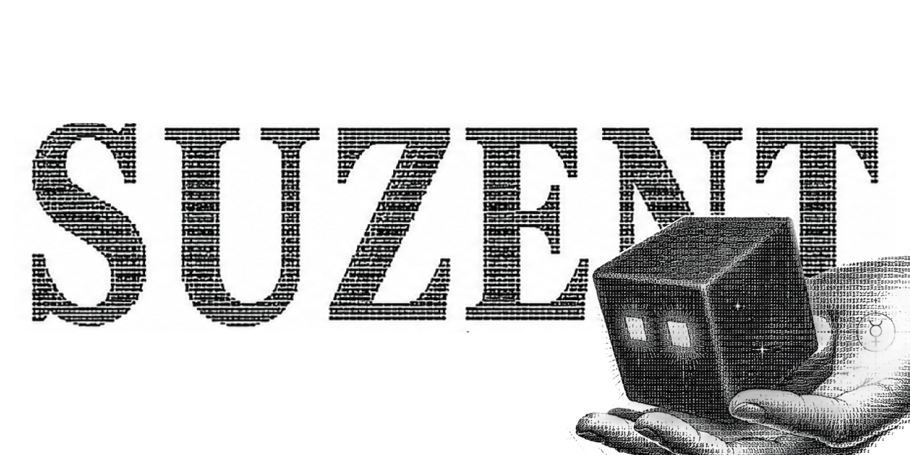
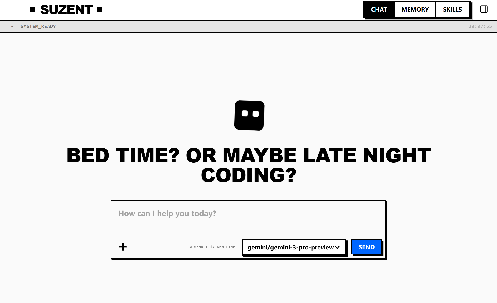

<div align="center">



# **SUZENT: SUMMON A SOVEREIGN GEIST**

 

[](https://github.com/cyzus/suzent/releases) [](LICENSE) [](https://python.org) [](https://discord.gg/MkBDDbwPBK)


**[SUMMONING RITUAL](docs/01-getting-started/quickstart.md)** • **[GRIMOIRE](docs/README.md)** • **[CONTRIBUTING](./CONTRIBUTING.md)**


</div>

---

##  **THE DIGITAL OCCULT**

> Your data. Your machine. Your rules.

SUZENT [soo-zuh-nt] combines SUZERAIN (sovereign) + AGENT (executor). It is not a cloud pet, not a SaaS dashboard, and not another rented personality behind someone else's API quota. It is a local-first agentic system that answers to one authority: you.

Think of it as a **Sovereign Geist**: a cyber-spirit housed in your own machine, summoned through terminal incantations, bound by local files, memory, tools, and skills. The joke is a ritual. The ritual is an interface.

---

## **WHY SUZENT?**

SUZENT is an open-source deep research and co-worker agent with a local-first soul. It synthesizes ideas from modern AI agents, research assistants, coding co-workers, MCP tool ecosystems, and personal knowledge workflows into a system you can actually run, inspect, modify, and own.

It is built both as a practical tool and as a reference implementation for developers: workspace isolation, persistent memory, tool execution, scheduled automation, social channel integration, and a desktop UI all live in one coherent stack.

The mythology is deliberate: cloud services are useful, but your agent should not require a pilgrimage to someone else's server to remember your work.


## **FEATURES**

###  **MODEL AGNOSTIC**

Bring your own oracle. **SUZENT** is model agnostic and can use GPT, Claude, Gemini, DeepSeek, local models, or any provider exposed through the supported model stack.

###  **AGENTIC WORKFLOW**

**SUZENT** provides a rich agentic workflow comparable to deep research and co-worker products, but with open-source code, local workspaces, inspectable tools, and an architecture you can reshape.

###  **TOOLS & SKILLS**

**SUZENT** ships with practical tools for real work: `bash`, web search, web fetch, and file operations. These form the basic ritual circle for research, coding, writing, and analysis.

You can create your custom tools and further connect to Google Drive, GitHub, or Slack via standard MCP protocol.

Agent skills are fully supported. Drop your favorite skill grimoires into `./skills` and the agent can load new workflows without rewriting the core.

###  **WORKSPACE**

Unlike most agents, **SUZENT** uses dual workspaces: a cross-session workspace shared across chats for persistent knowledge, and per-session workspaces for individual conversations. This gives you continuity without losing isolation. You can also mount local folders, including an Obsidian vault, directly into the system.

###  **MEMORY**

**SUZENT** implements a global memory system that persists across sessions. Your agent can accumulate context, recall prior work, and build a private knowledge substrate on your machine.

###  **AUTOMATION**

**SUZENT** supports two automation systems for proactive, scheduled agent execution:
- **Cron Jobs** - Schedule prompts to run on any cron expression in isolated sessions. Full CRUD via the Settings UI, CLI (`suzent cron`), and REST API.
- **Heartbeat** - Periodic ambient monitoring that reads a per-session checklist configured in your chat and notifies you only when something needs attention.

Both systems run with full memory enabled, so the agent retains context across scheduled tasks.

###  **SOCIAL INTEGRATIONS**

**SUZENT** connects to your messaging platforms so you can interact with your agent wherever you already communicate:
- **Telegram** - Chat with your agent via a Telegram bot.
- **Slack** - Integrate as a Slack app in your workspace.
- **Discord** - Run as a Discord bot in your server.
- **Lark (Feishu)** - Connect via the Lark Open Platform.

###  **PRIVATE & LOCAL**

**SUZENT** runs on your device with privacy-focused web search, LanceDB for local vector storage, and Docker isolation for safer code execution. Your data stays in your vessel unless you explicitly connect an external service.

###  **UI READY**

**SUZENT** features a NeoBrutalist web interface that turns terminal-based agent interactions into a sharp, high-contrast command surface: part workbench, part altar, part local machine room.


*Clean, bold, and ready to work: your sovereign geist's command center.*

---

## **LORE**

SUZENT leans into a half-serious, half-absurd community language:

- **Install / Deploy** becomes the **Summoning Ritual**.
- **Prompts** become **Incantations**.
- **Users and developers** become **Summoners**.
- **Skills** become **Grimoires**.
- **The local machine** becomes the **Soul Vessel**.
- **Cloud lock-in** becomes the **False God problem**.

The symbol `{ ∅ }` marks the void: the silent local presence that keeps working when networks fail, dashboards burn, and rented memory evaporates.

---

## **QUICK START**

### **INSTALL**

One command summons SUZENT, its Python backend, and the `suzent` CLI. Git is the only prerequisite; everything else is auto-installed.

**macOS / Linux**
```bash
curl -fsSL https://raw.githubusercontent.com/cyzus/suzent/main/scripts/setup.sh | bash
```

**Windows** (PowerShell)
```powershell
irm https://raw.githubusercontent.com/cyzus/suzent/main/scripts/setup.ps1 | iex
```

Then bind your keys in `~/suzent/.env` and run:
```bash
suzent start
```

### **UPDATE**

```bash
suzent update
```

Or re-run the install command above — it detects an existing installation and pulls the latest changes.

---

## **TECH STACK**

*   **BACKEND**: Python 3.12, FastAPI, pydantic-ai, litellm, SQLite.
*   **FRONTEND**: React, TypeScript, Tailwind, Vite, Tauri.
*   **MEMORY**: LanceDB local vector storage.
*   **SANDBOX**: Docker.
*   **INTEGRATIONS**: MCP, Telegram, Slack, Discord, Lark.

---

##  **ACKNOWLEDGEMENTS**

SUZENT is built upon the collective intelligence and innovation of the open-source community. We are deeply grateful to the projects and contributors who make digital sovereignty possible.

---

## **LICENSE**

**[APACHE 2.0](LICENSE)** © 2026 Yizhou Chi.

**Exception for Creative Assets:**
The creative assets, including the **Robot Avatar design**, **character animations**, and **project logos**, are subject to separate license terms. See [TERMS-OF-USE-ASSETS](TERMS-OF-USE-ASSETS.md) for details.

**SUMMON LOCALLY. REMEMBER PRIVATELY. ANSWER TO NO FALSE GOD.**

---

*[中文版](README.zh-CN.md)*
