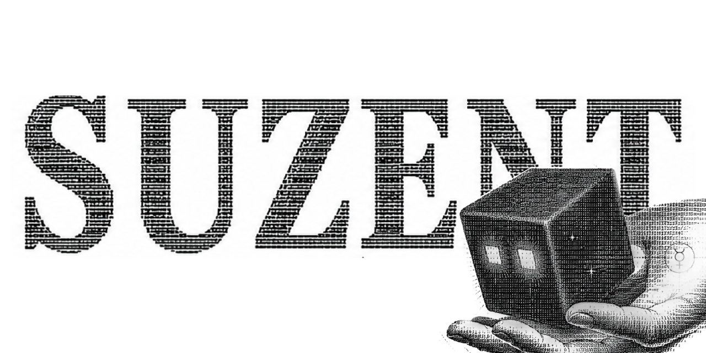
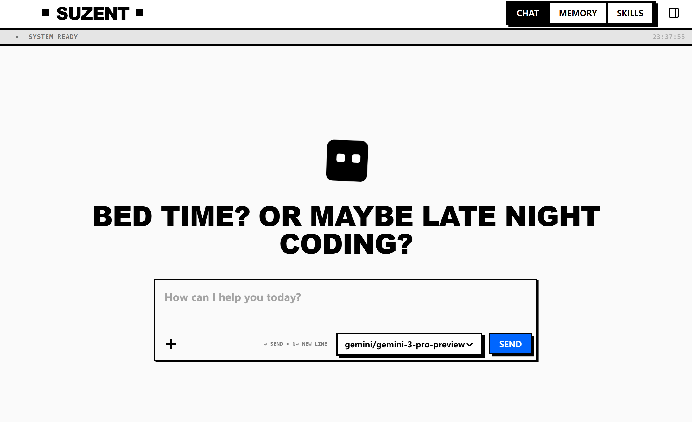

<div align="right">

*[中文版](README.zh-CN.md)*

</div>

<div align="center">



# **SUZENT: THE SOVEREIGN AI AGENT**

### **YOUR AGENT SHOULD NOT BE AN ACCOUNT YOU RENT.**

 

[](https://github.com/cyzus/suzent/releases) [](LICENSE) [](https://python.org) [](https://discord.gg/MkBDDbwPBK)


**[WEBSITE](https://suzent.com)** • **[SUMMONING RITUAL](docs/01-getting-started/quickstart.md)** • **[GRIMOIRE](docs/README.md)** • **[CONTRIBUTING](./CONTRIBUTING.md)**


</div>

---

##  **SUMMON A SOVEREIGN GEIST**

> Your agent should not be an account you rent. It should be a system you own.

**SUZENT** [soo-zuh-nt] is an open-source, local-first AI agent whose identity, memory, skills, workspace, and runtime remain under your control. Use GPT, Claude, Gemini, DeepSeek, local models, or whatever comes next without resetting the agent that knows you and your work.

It can research, write, code, pursue goals, run scheduled work, use tools, connect to your devices, and meet you in your existing channels. Every capability operates inside boundaries you define.

**Models are replaceable. Platforms are temporary. Your agent remains.**

---

## **WHAT MAKES AN AGENT SOVEREIGN?**

| Question | SUZENT's answer |
|---|---|
| Who owns its memory? | **You.** Markdown files are the durable source of truth. |
| Who chooses its intelligence? | **You.** Models and providers are replaceable. |
| Who defines what it may do? | **You.** Permissions, rules, and sandbox boundaries are explicit. |
| Where does it live? | **On infrastructure you control.** |
| Can it move? | Memory, skills, and configuration are portable; credentials stay local. |
| Can you inspect it? | Tool calls, authorization decisions, files, and memory remain visible. |

Sovereignty is not merely local execution. It is ownership of the agent's **mind, authority, vessel, and continuity**.

## **THE SOVEREIGN SYSTEM**

###  **CHOOSE ITS INTELLIGENCE**

Models are engines, not identities. Switch between GPT, Claude, Gemini, DeepSeek, local models, and compatible providers without surrendering the memory, skills, or workspace that make the agent yours.

###  **OWN ITS MEMORY**

Conversation facts are captured in append-only Markdown logs, consolidated into an inspectable notebook, and indexed for semantic recall. The files remain authoritative; the LanceDB index can be rebuilt. Read, edit, delete, version, and carry the agent's memory yourself.

###  **GOVERN ITS ACTIONS**

Autonomy never makes the agent the authority. Tool calls pass through explicit permission modes, scoped rules, path restrictions, and human approval. Docker workspaces isolate execution, while the activity timeline records what ran, what changed, and why it was authorized.

###  **CONTROL ITS VESSEL**

Run SUZENT on Windows, macOS, or Linux. Keep project workspaces isolated, share selected knowledge across conversations, mount folders you already own—including an Obsidian vault—and extend the system across approved companion devices.

###  **LET IT WORK**

Goals, project tasks, subagents, Cron, and Heartbeat let the agent continue beyond one reply. Interactive turns checkpoint their session workspace before work begins, so retry can restore both the conversation and local changes—not just regenerate the text.

###  **KEEP ITS CONTINUITY**

GitHub Sync carries portable configuration, user skills, and Markdown memory through a private repository while credentials remain device-local. A provider can disappear, a model can change, and a machine can be replaced without taking the agent's continuity with it.

###  **OPEN BY DESIGN**

Use built-in tools for files, shell execution, research, browsing, and interactive Canvas output. Add domain knowledge through portable `SKILL.md` packages, connect external systems through MCP, and talk through the desktop UI, Telegram, Slack, Discord, or Lark.


*Clean, bold, and ready to work: your sovereign geist's command center.*

---

## **LORE**

SUZENT leans into a half-serious, half-absurd community language:

- **Install / Deploy** becomes the **Summoning Ritual**.
- **Prompts** become **Incantations**.
- **Users and developers** become **Summoners**.
- **Skills** become **Grimoires**.
- **The local machine** becomes the **Soul Vessel**.
- **Cloud lock-in** becomes the **False God problem**.

The symbol `{ ∅ }` marks the void: the silent local presence that keeps working when networks fail, dashboards burn, and rented memory evaporates.

---

## **QUICK START**

### **INSTALL**

One command summons SUZENT, its Python backend, and the `suzent` CLI. Git is the only prerequisite; everything else is auto-installed.

**macOS / Linux**
```bash
curl -fsSL https://raw.githubusercontent.com/cyzus/suzent/main/scripts/setup.sh | bash
```

**Windows** (PowerShell)
```powershell
powershell -NoProfile -ExecutionPolicy Bypass -Command "irm https://raw.githubusercontent.com/cyzus/suzent/main/scripts/setup.ps1 | iex"
```

**Mainland China mirror mode**
```bash
curl -fsSL https://raw.githubusercontent.com/cyzus/suzent/main/scripts/setup.sh | SUZENT_CHINA_MIRROR=1 bash
```

```powershell
$env:SUZENT_CHINA_MIRROR="1"; powershell -NoProfile -ExecutionPolicy Bypass -Command "irm https://raw.githubusercontent.com/cyzus/suzent/main/scripts/setup.ps1 | iex"
```

This uses faster mirrors for PyPI, npm, Playwright, Node via nvm, and Rustup. If GitHub itself is slow, set `SUZENT_REPO_URL` or `SUZENT_RELEASE_BASE_URL` to a mirror you trust before running the command.

Then bind your keys in `~/suzent/.env` and run:
```bash
suzent start
```

### **UPDATE**

```bash
suzent update
```

Or re-run the install command above — it detects an existing installation and pulls the latest changes.

---

## **TECH STACK**

*   **BACKEND**: Python 3.12, FastAPI, pydantic-ai, litellm, SQLite.
*   **FRONTEND**: React, TypeScript, Tailwind, Vite, Tauri.
*   **MEMORY**: LanceDB local vector storage.
*   **SANDBOX**: Docker.
*   **INTEGRATIONS**: MCP, Telegram, Slack, Discord, Lark.

---

##  **ACKNOWLEDGEMENTS**

SUZENT is built upon the collective intelligence and innovation of the open-source community. We are deeply grateful to the projects and contributors who make digital sovereignty possible.

---

## **LICENSE**

**[APACHE 2.0](LICENSE)** © 2026 Yizhou Chi.

**Exception for Creative Assets:**
The creative assets, including the **Robot Avatar design**, **character animations**, and **project logos**, are subject to separate license terms. See [TERMS-OF-USE-ASSETS](TERMS-OF-USE-ASSETS.md) for details.

**SUMMON LOCALLY. REMEMBER PRIVATELY. ANSWER TO NO FALSE GOD.**
