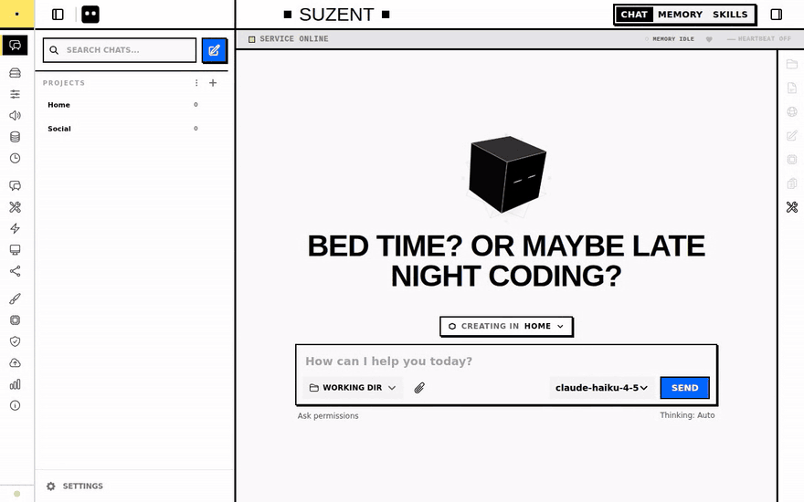

<div align="right">

*[中文版](README.zh-CN.md)*

</div>

<div align="center">


# **SUZENT: THE SOVEREIGN AI AGENT**

### **Your agent should not be an account you rent.**

An open-source, local-first personal AI agent whose memory, authority, runtime, and continuity stay yours.

Memory in plain files you own · any model, cloud or local · tools that act only within your permissions · desktop, mobile, and the chat apps you already use

[](https://github.com/cyzus/suzent/releases) [](https://github.com/cyzus/suzent/stargazers) [](LICENSE) [](https://python.org) [](https://discord.gg/MkBDDbwPBK)

**[Website](https://suzent.com)** • **[Quickstart](docs/01-getting-started/quickstart.md)** • **[Docs](docs/README.md)** • **[Discord](https://discord.gg/MkBDDbwPBK)** • **[Contributing](./CONTRIBUTING.md)**



</div>

---

##  **MEET SUZENT**

**SUZENT** [soo-zuh-nt] keeps an agent's identity, memory, skills, workspace, and runtime under your control. Use GPT, Claude, Gemini, DeepSeek, local models, or whatever comes next without resetting the agent that knows you and your work.

Its memory is append-only Markdown on your disk, not rows in someone else's database. Its tool calls pass through permission modes you define. Its code runs in an isolated Docker sandbox, or on the host under path restrictions you set. It can research, write, code, pursue goals, run scheduled work, connect to your devices, and meet you in Telegram, Slack, Discord, Feishu, or WeChat — always inside boundaries you set.

**Models are replaceable. Platforms are temporary. Your agent remains.**

---

## **QUICK START**

SUZENT runs on Windows, macOS, and Linux. Git is the only prerequisite; everything else is installed for you.

**macOS / Linux**
```bash
curl -fsSL https://raw.githubusercontent.com/cyzus/suzent/main/scripts/setup.sh | bash
```

**Windows** (PowerShell)
```powershell
powershell -NoProfile -ExecutionPolicy Bypass -Command "irm https://raw.githubusercontent.com/cyzus/suzent/main/scripts/setup.ps1 | iex"
```

Then start it and add a model under **Settings → Providers**:

```bash
suzent start
```

No API key? Pick [Ollama](docs/04-models/local/ollama.md) and run everything on your own machine.

<details>
<summary><b>Mainland China mirror mode</b></summary>

```bash
curl -fsSL https://raw.githubusercontent.com/cyzus/suzent/main/scripts/setup.sh | SUZENT_CHINA_MIRROR=1 bash
```

```powershell
$env:SUZENT_CHINA_MIRROR="1"; powershell -NoProfile -ExecutionPolicy Bypass -Command "irm https://raw.githubusercontent.com/cyzus/suzent/main/scripts/setup.ps1 | iex"
```

This uses faster mirrors for PyPI, npm, Playwright, Node via nvm, and Rustup. If GitHub itself is slow, set `SUZENT_REPO_URL` or `SUZENT_RELEASE_BASE_URL` to a mirror you trust before running the command.

</details>

<details>
<summary><b>The <code>suzent</code> CLI</b></summary>

```bash
suzent --version       # Print the backend version, commit, and UI version
suzent start           # Start the backend and the desktop app (in the background)
suzent serve           # Start the backend only (headless / standalone)
suzent web             # Open the web console against the backend
suzent ui              # Start the desktop app against a running backend
suzent logs -f         # Follow the log of a backgrounded process
suzent stop            # Stop the backend server and the dev frontend
suzent restart         # Stop a running backend server, then start Suzent again
suzent doctor          # Check requirements and diagnose a broken install
suzent update          # Update to the latest stable release
suzent check-update    # Report whether a newer release exists
suzent repair          # Recover an interrupted or damaged update
```

Run `suzent --help`, or `suzent <command> --help`, for the full flag set.

</details>

<details>
<summary><b>Updating</b></summary>

```bash
suzent update
```

This installs the latest stable release as one matched set: backend source, locked dependencies, and desktop app. A standalone updater performs the switch outside the active virtual environment, verifies downloaded assets, and rolls back automatically on failure. If an interrupted update needs recovery, run `suzent repair`.

Developers working from a source checkout can update `main` and its frontend dependencies together with plain `suzent update`; the checkout is detected automatically. The explicit equivalent is `suzent update --dev`.

Or re-run the install command above — it detects an existing installation and updates it to the latest stable release.

</details>

---

## **WHAT MAKES AN AGENT SOVEREIGN?**

| Question | SUZENT's answer |
|---|---|
| Who owns its memory? | **You.** Markdown files are the durable source of truth. |
| Who chooses its intelligence? | **You.** Models and providers are replaceable. |
| Who defines what it may do? | **You.** Permissions, rules, and sandbox boundaries are explicit. |
| Where does it live? | **On infrastructure you control.** |
| Can it move? | Memory, skills, and configuration are portable; credentials stay local. |
| Can you inspect it? | Tool calls, authorization decisions, files, and memory remain visible. |

Sovereignty is not merely local execution. It is ownership of the agent's **mind, authority, vessel, and continuity**.

## **THE SOVEREIGN SYSTEM**

###  **CHOOSE ITS INTELLIGENCE**

Models are engines, not identities. Switch between GPT, Claude, Gemini, DeepSeek, local models, and compatible providers without surrendering the memory, skills, or workspace that make the agent yours.

###  **OWN ITS MEMORY**

Conversation facts land in append-only Markdown logs, consolidate into an inspectable notebook, and are indexed for semantic recall—the files stay authoritative, and the LanceDB index can be rebuilt from them at any time. Read, edit, delete, version, and carry that memory yourself.

###  **GOVERN ITS ACTIONS**

Autonomy never makes the agent the authority. Tool calls pass through explicit permission modes, scoped rules, path restrictions, and human approval. An optional Docker sandbox isolates execution, while the activity timeline records what ran, what changed, and why it was authorized.

###  **RUN IT ANYWHERE, LET IT WORK**

Goals, project tasks, subagents, Cron, and Heartbeat let the agent continue beyond one reply, inside isolated project workspaces and folders you already own—including an Obsidian vault—and across approved companion devices. Interactive turns checkpoint their session workspace before work begins, so retry restores both the conversation and local changes—not just the text.

Extend it further with portable `SKILL.md` packages and any MCP server you connect.

###  **KEEP ITS CONTINUITY**

GitHub Sync carries portable configuration, user skills, and Markdown memory through a private repository while credentials remain device-local. A provider can disappear, a model can change, and a machine can be replaced without taking the agent's continuity with it.

---

## **WHERE YOU TALK TO IT**

One agent, one memory, reachable from several surfaces. Messaging channels are off by default and access-controlled: a user ID must appear in `allowed_users` before the agent will answer it.

| Surface | Transport | Supports | Setup |
|---|---|---|---|
| **Desktop app** | Local backend | Full UI, Canvas, memory and skills browsers | `suzent start` |
| **Mobile app** (preview) | Paired with your desktop | Shared conversations | [Guide](docs/03-features/nodes.md#pair-your-phone) |
| **Telegram** | Bot API | Text, photos, files | [Guide](docs/05-chat-apps/telegram.md) |
| **Slack** | Socket Mode (Events API) | Text, files | [Guide](docs/05-chat-apps/slack.md) |
| **Discord** | Gateway | Text, files | [Guide](docs/05-chat-apps/discord.md) |
| **Feishu (Lark)** | WebSocket | Text, files | [Guide](docs/05-chat-apps/feishu.md) |
| **WeChat** | iLink Bot API | Text | [Guide](docs/05-chat-apps/wechat.md) |

Each conversation becomes a persistent session, so history, working memory, and extracted facts survive a restart. Uploaded files land in the sandbox at `/persistence/uploads/`.

---

## **DOCUMENTATION**

| Section | What's covered |
|---|---|
| [What is Suzent?](docs/01-getting-started/intro.md) | What a sovereign agent is and what Suzent can do |
| [Quickstart](docs/01-getting-started/quickstart.md) | Install, connect a model, and start chatting |
| [Models & Providers](docs/04-models/README.md) | OpenAI, Anthropic, Gemini, Ollama, and more, plus model roles |
| [Memory](docs/03-features/memory/README.md) | What the agent remembers, where it lives, and how to edit it |
| [Notebook](docs/03-features/memory/llm-wiki.md) | Agent-maintained, Obsidian-compatible knowledge vault |
| [Tools](docs/03-features/tools/README.md) | Everything the agent can do, and how to turn it on or off |
| [Permissions & approvals](docs/03-features/tools/human-in-the-loop.md) | How Suzent asks before it acts |
| [Skills](docs/03-features/skills.md) | Install, write, and manage portable `SKILL.md` packages |
| [Workspace & sandbox](docs/03-features/filesystem.md) | Folders, the Docker sandbox, and undoing a turn |
| [Automation](docs/03-features/automation.md) | Scheduled tasks, heartbeats, goals, and the background service |
| [Chat apps](docs/05-chat-apps/README.md) | Telegram, Slack, Discord, Feishu, WeChat |
| [Devices & other agents](docs/03-features/nodes.md) | Your phone, other computers, A2A agents, and your editor |
| [GitHub Sync](docs/03-features/github-sync.md) | Carry your agent to another computer through a private repo |
| [Development Guide](docs/08-developing/contributing/development-guide.md) | Setup, workflow, builds, architecture |
| [Native Mobile](docs/08-developing/architecture/mobile.md) | SwiftUI/Compose developer preview, monorepo layout, and roadmap |

The full index lives in [docs/README.md](docs/README.md).

---

## **TECH STACK**

*   **BACKEND**: Python 3.12, FastAPI, pydantic-ai, litellm, SQLite.
*   **FRONTEND**: React, TypeScript, Tailwind, Vite, Tauri.
*   **MEMORY**: LanceDB local vector storage.
*   **SANDBOX**: Docker (optional).
*   **EXTENSIBILITY**: MCP, portable `SKILL.md` packages.

---

## **CONTRIBUTING**

Contributions welcome. See [CONTRIBUTING.md](./CONTRIBUTING.md) for the workflow, and the [Development Guide](docs/08-developing/contributing/development-guide.md) for setup, production builds, and architecture.

---

## **SECURITY**

Found a vulnerability? Please report it privately—see [SECURITY.md](SECURITY.md). Do not open a public issue.

---

## **LICENSE**

**[APACHE 2.0](LICENSE)** © 2026 Yizhou Chi.

**Exception for Creative Assets:**
The creative assets, including the **Robot Avatar design**, **character animations**, and **project logos**, are subject to separate license terms. See [TERMS-OF-USE-ASSETS](TERMS-OF-USE-ASSETS.md) for details.

**SUMMON LOCALLY. REMEMBER PRIVATELY. ANSWER TO NO FALSE GOD.**
