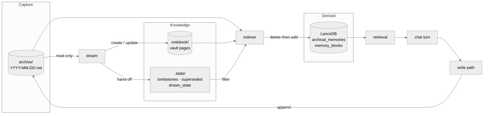
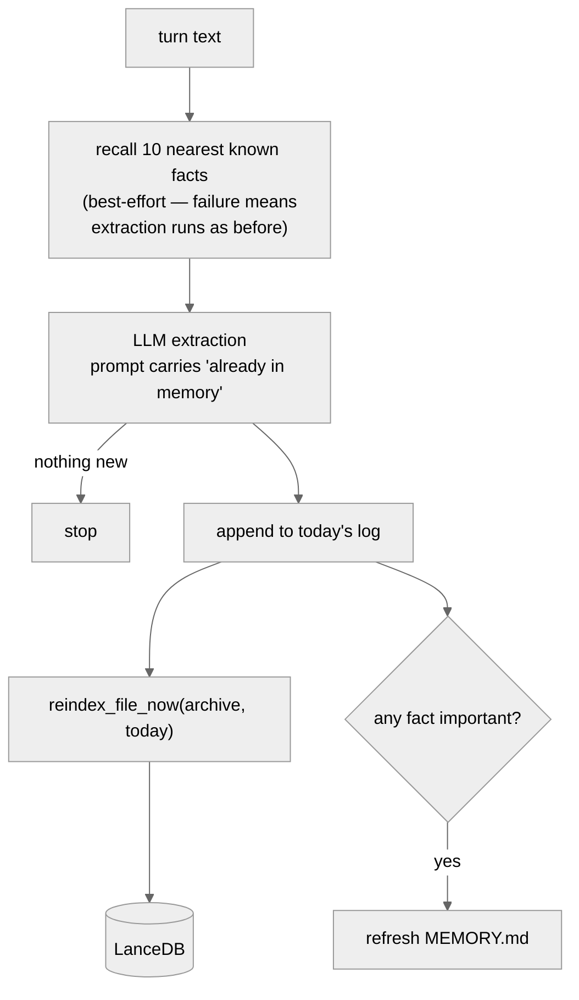
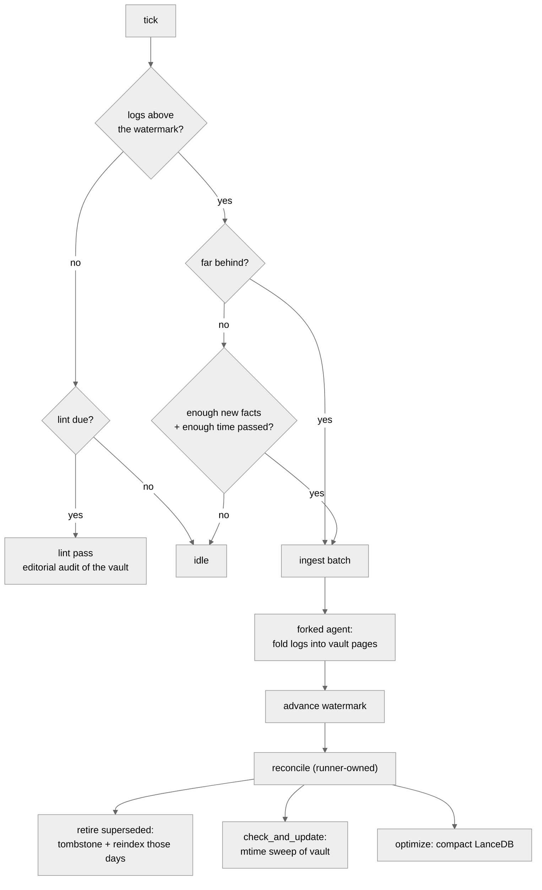
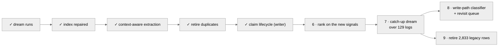

# Memory Architecture

How memory is written, consolidated, indexed, and read — and what is still missing.
Companions: [Consolidation](./consolidation.md) for the dream's design intent,
[Deduplication](./deduplication.md) for the duplicate problem and its fixes.

## Three tiers, one job each

| tier | location | job | who writes it |
| --- | --- | --- | --- |
| Capture buffer | `sandbox/shared/memory/archive/YYYY-MM-DD.md` | Lossless and fast. Never reasoned over at write time. | write path, append only |
| Knowledge base | `~/.suzent/notebook/**/*.md` | Consolidated claims with provenance and lifecycle | the dream, via file tools |
| Search index | `~/.suzent/memory` (LanceDB) | Derived. Rebuilt per file, never authored. | the indexer, exclusively |

The direction of travel is one-way: logs feed the vault, both feed the index, and the
index feeds retrieval. Nothing reads back up the chain.

## Write path, per conversation turn

Runs after the assistant response completes, in
`MemoryManager.process_conversation_turn_for_memories`.

There is deliberately **no write-time deduplication**. A 0.85 cosine threshold used to
sit here and silently dropped *updates* to facts (#34). Repetition is suppressed one step
earlier instead — the extractor is shown what memory already holds and told that a fact
which *changes* a known one must still be emitted.

## The dream

A background loop ticking every `memory_consolidation_interval_seconds`. It has one gate
and two phases.

Ingest is always preferred over lint, so an editorial audit can never starve
consolidation of new logs.

### Why the reconcile belongs to the runner

The agent's only declared capability is writing files. It hands the runner a list of log
facts it has folded into pages, in `notebook/.state/superseded.txt`; the runner
tombstones each line, reindexes each affected day, and truncates the file last so a crash
replays rather than loses.

The explicit reindex is not a belt-and-braces measure. **Appending a tombstone does not
change the log's mtime**, so the watcher — which triggers on mtime — would never revisit
those days on its own.

## Invariants worth not breaking

1. **Daily logs are append-only.** Never rewritten, so nothing races the live write path
   appending to today's file.
2. **The indexer is the only writer to LanceDB.** Every other component asks it.
3. **The indexer is not append-only.** Only the markdown history is. `_reindex_file` is
   delete-then-add per file, which is what makes reindexing idempotent and safe to repeat.
4. **Tombstones are the only removal mechanism.** History stays intact; the derived row
   disappears. Every tombstone write must be paired with an explicit reindex.
5. **Recall enrichment must never block a write.** A search outage degrades extraction
   quality, never durability.

## What landed in PR #118

| commit | what it fixes |
| --- | --- |
| `70994416` | The dream barely ran. Retry counters were in-memory, so retry-then-skip never fired across restarts and the watermark sat at `2026-03-11` for five months. |
| `50621860` | Indexer state was keyed by absolute path in a synced directory — 436 entries from two machines, and only 18 of 129 logs actually indexed. Now `label:filename`, versioned, pre-v2 discarded. |
| `ca421b74` | Extraction was context-free. The prompt now carries the nearest known facts, with an explicit rule permitting updates. |
| `5fc97850` | The dream resolved duplicates by doing nothing. It now retires folded-in log lines through the tombstone hand-off. |
| `07f24c4b` | Repeats had nowhere to go but the bin. Personal claims now carry `(confirmed 12x, last YYYY-MM-DD)` and a category-derived `stale_after`. |

## Next steps

**6 — Rank on the signals now being written.** Confirmation count, `stale_after`, and
`status` are produced but nothing reads them. Retrieval still treats a claim confirmed
twelve times exactly like a one-off. Also open here: recording a user's own edit to a core
memory block as a `human:` `verified` actor, so a person's correction outranks anything the
extractor produced.

**7 — The catch-up dream.** 129 logs sit above the watermark. This is the first step that
*mutates live memory* — it rewrites vault pages and tombstones archival rows across five
months of backlog, driven by an LLM, and it is where a bad `superseded.txt` line costs
real facts. It should run against a copy of `~/.suzent` first, with the diff reviewed
before anything touches the real vault.

**8 — Write-path classifier and revisit queue.** Classify each extracted fact against the
recalled set: ≥0.97 with no new specifics is a confirmation (one line to a
`confirmations.jsonl` sidecar, folded in by the dream), 0.90–0.97 a revision, below that
new. The revisit queue selects vault claims past their `stale_after`. Neither should land
before step 7 — a classifier is only as good as the claims it compares against.

**9 — Retire the legacy rows.** 2,833 pre-June rows predate the current write path and
carry no source file, so they cannot be reindexed, only deleted.
