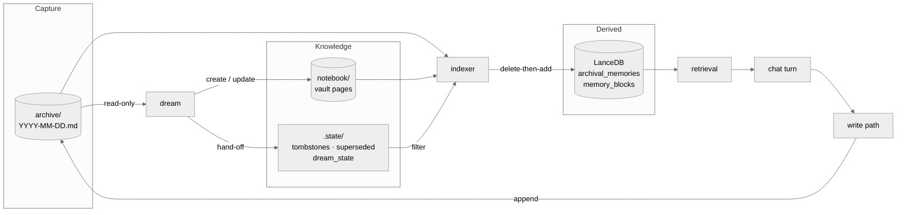
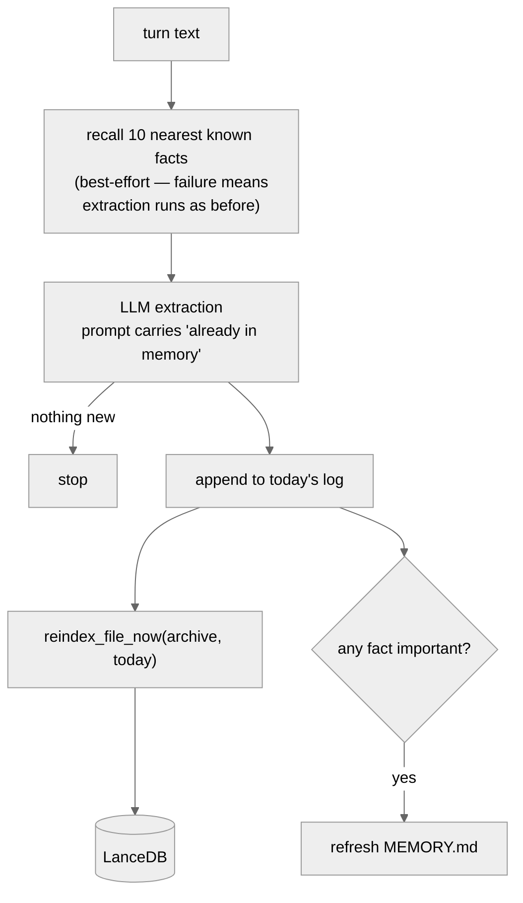
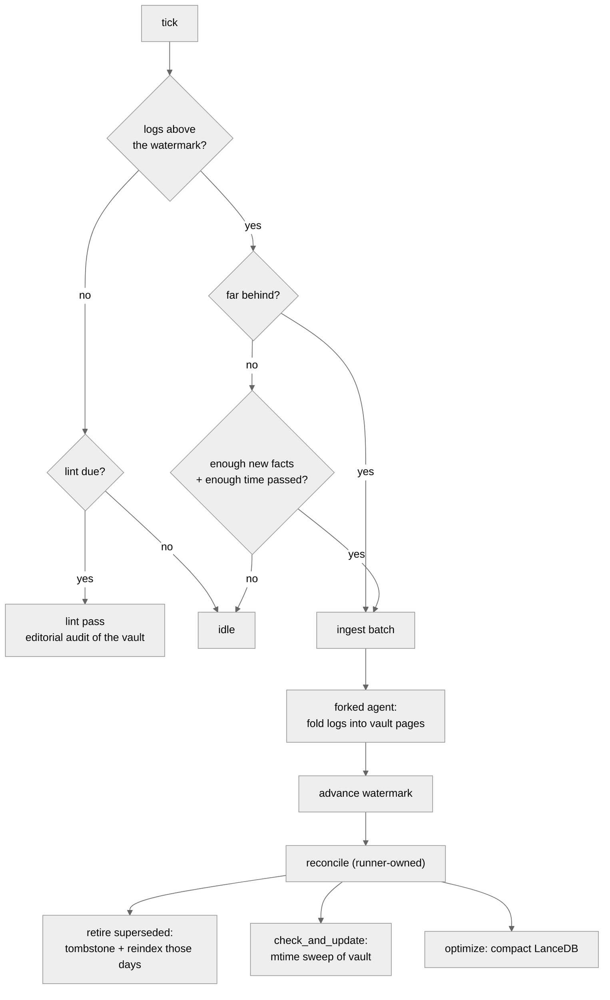
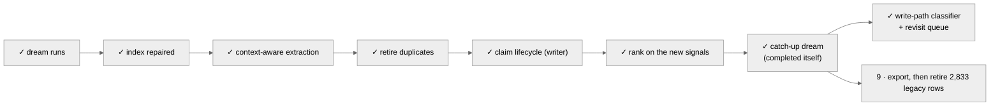

# Memory Architecture

How memory is written, consolidated, indexed, and read — and what is still missing.
Companions: [Consolidation](./consolidation.md) for the dream's design intent,
[Deduplication](./deduplication.md) for the duplicate problem and its fixes.

## Three tiers, one job each

| tier | location | job | who writes it |
| --- | --- | --- | --- |
| Capture buffer | `sandbox/shared/memory/archive/YYYY-MM-DD.md` | Lossless and fast. Never reasoned over at write time. | write path, append only |
| Knowledge base | `~/.suzent/notebook/**/*.md` | Consolidated claims with provenance and lifecycle | the dream, via file tools |
| Search index | `~/.suzent/memory` (LanceDB) | Derived. Rebuilt per file, never authored. | the indexer, exclusively |

The direction of travel is one-way: logs feed the vault, both feed the index, and the
index feeds retrieval. Nothing reads back up the chain.

## Write path, per conversation turn

Runs after the assistant response completes, in
`MemoryManager.process_conversation_turn_for_memories`.

There is deliberately **no write-time deduplication**. A 0.85 cosine threshold used to
sit here and silently dropped *updates* to facts (#34). Repetition is suppressed one step
earlier instead — the extractor is shown what memory already holds and told that a fact
which *changes* a known one must still be emitted.

## The dream

A background loop ticking every `memory_consolidation_interval_seconds`. It has one gate
and two phases.

Ingest is always preferred over lint, so an editorial audit can never starve
consolidation of new logs.

### Why the reconcile belongs to the runner

The agent's only declared capability is writing files. It hands the runner a list of log
facts it has folded into pages, in `notebook/.state/superseded.txt`; the runner
tombstones each line, reindexes each affected day, and truncates the file last so a crash
replays rather than loses.

The explicit reindex is not a belt-and-braces measure. **Appending a tombstone does not
change the log's mtime**, so the watcher — which triggers on mtime — would never revisit
those days on its own.

## Invariants worth not breaking

1. **Daily logs are append-only.** Never rewritten, so nothing races the live write path
   appending to today's file.
2. **The indexer is the only writer to LanceDB.** Every other component asks it.
3. **The indexer is not append-only.** Only the markdown history is. `_reindex_file` is
   delete-then-add per file, which is what makes reindexing idempotent and safe to repeat.
4. **Tombstones are the only removal mechanism.** History stays intact; the derived row
   disappears. Every tombstone write must be paired with an explicit reindex.
5. **Recall enrichment must never block a write.** A search outage degrades extraction
   quality, never durability.
5b. **The write path may recognise a repeat, never an update.** The one case it is
   allowed to divert is a word-for-word restatement of a claim already recorded in an
   append-only store, adding no new specifics. Anything else — a new detail, a
   contradiction, a match found only in a transcript — is written exactly as before.
   Issue #34 was this line being crossed.
6. **Only the generated zone of `MEMORY.md` is generated.** The file has two generators
   and an agent editing it directly; everything after the `<!-- /memory:generated -->`
   marker is copied through untouched, and a file with no marker that we cannot prove we
   wrote is treated as entirely manual.

### Who owns MEMORY.md

Two writers regenerate the same file. `refresh_core_memory_facts` (per turn, from the top
archival rows) is the legacy path; `promote_memory_md` (per productive dream, from
consolidated `3_Personal/` pages plus recall signal) is its replacement. The hand-over
needs no flag day: the legacy path stands down as soon as the vault has any personal page,
so as the dream fills the vault it simply stops firing.

Both write through the same marked zone, so an agent's or user's own notes below the
marker survive either of them.

## What landed in PR #118

| commit | what it fixes |
| --- | --- |
| `70994416` | Retry counters were in-memory, so retry-then-skip never fired across restarts and a wedged batch stranded the watermark at `2026-02-22`. (The original "barely ran" reading was measured against the wrong vault — see the correction in `deduplication.md`.) |
| `50621860` | Indexer state was keyed by absolute path in a synced directory — 436 entries from two machines, and only 18 of 129 logs actually indexed. Now `label:filename`, versioned, pre-v2 discarded. |
| `ca421b74` | Extraction was context-free. The prompt now carries the nearest known facts, with an explicit rule permitting updates. |
| `5fc97850` | The dream resolved duplicates by doing nothing. It now retires folded-in log lines through the tombstone hand-off. |
| `07f24c4b` | Repeats had nowhere to go but the bin. Personal claims now carry `(confirmed 12x, last YYYY-MM-DD)` and a category-derived `stale_after`. |
| `fb47218d` | This document. |
| `2af08c7b` | Every append to a daily log re-embedded the whole file — 28.5x amplification over the real corpus, quadratic in appends per day, and ~374k single-row inserts fragmenting the table. Archive reindex is now a diff, falling back to full replace if the diff query fails. |
| `7842c41d` | `MEMORY.md` was a blind overwrite with three writers, and the per-turn refresh filtered on an importance column the indexer stamps with a constant — so it rebuilt the file exclusively from pre-June legacy rows. |
| `d1067d4e` | The confirmation counts, `status`, and `stale_after` the dream writes were read by nothing; retrieval scored every row identically. |
| `5b21f156` | A dry-run harness for the dream, and a ranker that reads the status the live vault actually writes (`active`, not `stable`). |
| _this_ | Every re-statement of a known claim became another row competing with the original. The write path now recognises a word-for-word repeat of a durably recorded claim and records the recurrence instead. |

## Next steps

**6 — Rank on the signals now being written.** Done. A vault chunk's indexed `importance`
is derived from its confirmation count (log-scaled, capped at +0.25), its `status`
(`deprecated` drops it to 0.1, `draft` −0.05), and its `stale_after` (×0.6 once passed).
Daily-log facts keep the neutral 0.5 — raw capture has no lifecycle. A person's edit to the
`facts` block is recorded as a `human:` verification in the manual zone of `MEMORY.md`.

A person editing the `facts` block is the one claim in the system that did not come from
extraction — it is the claim's subject stating it directly — so `write_memory_manual_zone`
stamps the manual zone with a `human:` actor and retrieval now reads that stamp. It takes
an importance *floor* (`HUMAN_VERIFIED_FLOOR`, 0.9) rather than a bonus, so a low base
score cannot dilute it, and it skips the `stale_after` decay: an expiry means nobody has
re-confirmed the claim lately, which is exactly the question a human verification answers.
`deprecated` still wins — a person retiring a claim is also a person — and only a `human:`
actor qualifies, or an agent stamping itself would launder its own output into the
strongest evidence class there is. Because the floor applies per row, MEMORY.md is now
chunked per zone instead of per file: paragraph merging otherwise produced a single row
spanning the generated half and the human half, which is neither.

**7 — The catch-up dream.** Done, and not by us. The backlog was 129 logs because the
dream advanced the watermark by at most one day per run; the pacing fix in `70994416`
removed that ceiling and the backlog drained itself in the field. Measured on the live
system: watermark `2026-08-22`, 47 advances recorded in `log.md`, 130 archive logs
spanning `2026-02-09`–`2026-08-23`, and exactly one date pending — today's, which the
dream never ingests while it is still being appended to.

`scripts/dream_dry_run.py` remains, because the next mutating pass deserves the same
caution this one would have: it clones `~/.suzent`, redirects the `/mnt/notebook` volume
at a copy of the vault, and drives the real `DreamRunner` over the clone, leaving a
unified diff to review. The redirect is the point — the vault is a host path mounted into
the sandbox, *not* a directory inside the data dir, so cloning `~/.suzent` alone isolates
everything except the one thing the dream rewrites.

What the catch-up left behind is a gap, not a backlog. Those 309 pages were consolidated
under the pre-`07f24c4b` prompts: of the 18 `3_Personal` pages, 8 carry frontmatter and
**none carry a confirmation marker or a `stale_after`**. Step 6's ranking is live but has
nothing to read on existing pages — the lint pass is the backfill, and it should be
exercised against a clone before the real vault.

**8 — Write-path classifier and revisit queue.** Done. `memory/classifier.py` compares
each extracted fact against the recall set already assembled for the extraction prompt,
so it costs no extra retrieval and no extra model call — the comparison is lexical on
purpose, because the only band that changes behaviour is "practically the same
sentence", which is what a lexical measure is good at and what a semantic one is too
generous about.

Three outcomes. A **confirmation** (≥0.97 similar, no new specifics, matched against a
*durable* source) is not written to the daily log; it becomes a line in
`.state/confirmations.jsonl`, and the dream folds the count into the claim's
`(confirmed Nx)` marker. A **revision** (similar, or a strict superset carrying a new
specific) is written exactly as before and tagged `revision`. Everything else is
**new**. Two guards do the real work: a match found only in a chat transcript or in the
generated `MEMORY.md` can never divert a write, because neither is a record the write
path can defer to; and any new number, date, quote, path, or version in the restatement
makes it a revision however similar the surrounding prose (`moved to Berlin in 2024` is
not a repeat of `moved to Berlin`).

The **revisit queue** is a deterministic frontmatter scan by the runner, handed to the
dream alongside the confirmations: vault pages past their `stale_after`, soonest first,
to be re-confirmed against the logs being ingested — never deleted. Both queues are
runner-owned for the same reason the watermark is: index and lifecycle mutation stays
out of the agent's hands.

A `3_Personal/` page with no `stale_after` *at all* is queued too, after every genuinely
expired one. Every page written before `07f24c4b` is in that state — 6 of the live vault's
personal pages — and selecting strictly on the field would mean they are never queued, so
the dream never visits them, so the field is never written: the pages most in need of a
first pass would be the only ones permanently exempt from one. Letting the dream backfill
the field beats a script guessing it, because a wrong `stale_after` actively damps a good
claim in step 6's ranking and only the dream can see which category a claim belongs to.
The undated branch is scoped to `3_Personal/`: a wiki or project page having no expiry is
correct, not a backlog item. The confirmations sidecar is truncated only by the number of
lines the agent was actually shown, since conversations keep appending to it while the
dream runs.

**9 — Retire the legacy rows: export first, then delete.** 2,833 pre-June rows predate
the current write path and carry no source file, so no reindex can replace them and no
tombstone can retire them. The plan said deleting them was safe once `MEMORY.md` stopped
depending on them. Measuring rather than assuming overturned that: `scripts/retire_legacy_rows.py`
checked every legacy row's first 90 characters against every daily log and every vault
page, and **2,832 of 2,833 appear nowhere in markdown**. A separate 120-row random sample
found zero matches — not reworded, not summarised, not at all. These rows predate the
markdown tier, so the index is the only place that content exists; deleting them is data
loss, not index cleanup.

So the sequence is `--export` then `--apply`. The export appends each row to the daily
log for its `created_at` date, which puts it in the append-only tier, gives it a
`source_file` the indexer owns, and makes it something the dream can consolidate — only
then is the delete removing a duplicate. `--apply` copies the table directory to a
timestamped backup first, and refuses outright while any row is recorded nowhere else.
Neither has been run against the live index: the delete is irreversible beyond that
backup and the export writes 2,833 lines into the user's memory directory, so both are
the user's call.
