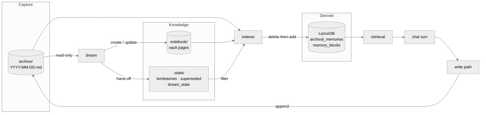
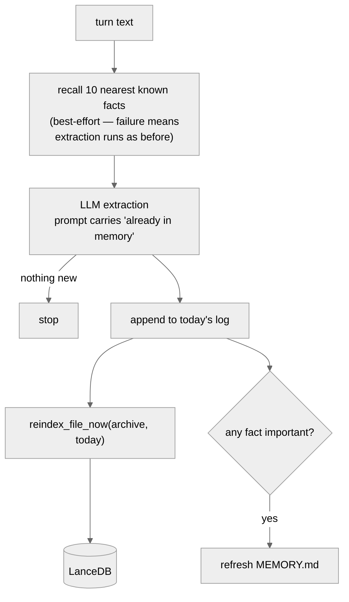
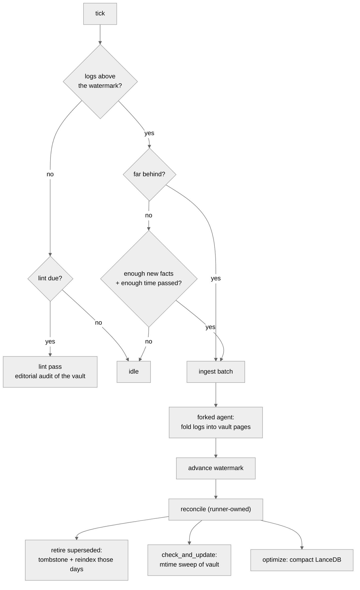

# Memory Architecture

How memory is written, consolidated, indexed, and read.
Companions: [Consolidation](../../02-concepts/memory/consolidation.md) for how the dream
behaves from the outside, [Internals](./internals.md) for the class-by-class reference.

## Three tiers, one job each

| tier | location | job | who writes it |
| --- | --- | --- | --- |
| Capture buffer | `sandbox/shared/memory/archive/YYYY-MM-DD.md` | Lossless and fast. Never reasoned over at write time. | write path, append only |
| Knowledge base | `~/.suzent/notebook/**/*.md` | Consolidated claims with provenance and lifecycle | the dream, via file tools |
| Search index | `~/.suzent/memory` (LanceDB) | Derived. Rebuilt per file, never authored. | the indexer, exclusively |

The direction of travel is one-way: logs feed the vault, both feed the index, and the
index feeds retrieval. Nothing reads back up the chain.

## Write path, per conversation turn

Runs after the assistant response completes, in
`MemoryManager.process_conversation_turn_for_memories`.

There is deliberately **no write-time deduplication**. A 0.85 cosine threshold used to
sit here and silently dropped *updates* to facts (#34). Repetition is suppressed one step
earlier instead — the extractor is shown what memory already holds and told that a fact
which *changes* a known one must still be emitted.

## The dream

A background loop ticking every `memory_consolidation_interval_seconds`. It has one gate
and two phases.

Ingest is always preferred over lint, so an editorial audit can never starve
consolidation of new logs.

### Why the reconcile belongs to the runner

The agent's only declared capability is writing files. It hands the runner a list of log
facts it has folded into pages, in `notebook/.state/superseded.txt`; the runner
tombstones each line, reindexes each affected day, and truncates the file last so a crash
replays rather than loses.

The explicit reindex is not a belt-and-braces measure. **Appending a tombstone does not
change the log's mtime**, so the watcher — which triggers on mtime — would never revisit
those days on its own.

## Invariants worth not breaking

1. **Daily logs are append-only.** Never rewritten, so nothing races the live write path
   appending to today's file.
2. **The indexer is the only writer to LanceDB.** Every other component asks it.
3. **The indexer is not append-only.** Only the markdown history is. `_reindex_file` is
   delete-then-add per file, which is what makes reindexing idempotent and safe to repeat.
4. **Tombstones are the only removal mechanism.** History stays intact; the derived row
   disappears. Every tombstone write must be paired with an explicit reindex.
5. **Recall enrichment must never block a write.** A search outage degrades extraction
   quality, never durability.
5b. **The write path may recognise a repeat, never an update.** The one case it is
   allowed to divert is a word-for-word restatement of a claim already recorded in an
   append-only store, adding no new specifics. Anything else — a new detail, a
   contradiction, a match found only in a transcript — is written exactly as before.
   Issue #34 was this line being crossed.
6. **Only the generated zone of `MEMORY.md` is generated.** The file has two generators
   and an agent editing it directly; everything after the `<!-- /memory:generated -->`
   marker is copied through untouched, and a file with no marker that we cannot prove we
   wrote is treated as entirely manual.

### Who owns MEMORY.md

Two writers regenerate the same file. `refresh_core_memory_facts` (per turn, from the top
archival rows) is the legacy path; `promote_memory_md` (per productive dream, from
consolidated `3_Personal/` pages plus recall signal) is its replacement. The hand-over
needs no flag day: the legacy path stands down as soon as the vault has any personal page,
so as the dream fills the vault it simply stops firing.

Both write through the same marked zone, so an agent's or user's own notes below the
marker survive either of them.

### Always resolve the vault path

The configured `notebook_dir` and the vault the dream actually writes to are not always the
same directory — a vault mounted at `/mnt/notebook` leaves a stale bootstrap skeleton at
the configured path. Anything inspecting or measuring the vault must go through
`resolve_notebook_dir()`, or it reports on the wrong tree.
## Borrowed from the Open Knowledge Format

[OKF v0.2](https://github.com/GoogleCloudPlatform/open-knowledge-format/blob/main/SPEC.md)
frontmatter is per-document, so it maps onto vault pages — which previously carried no
frontmatter at all — and not onto individual log fact lines. Daily logs stay dumb.
Producer-defined keys are explicitly permitted, so partial adoption is within its rules.

- `status: draft | stable | deprecated` — `deprecated` is a softer tombstone: the claim
  stays readable and linkable but leaves retrieval ranking, and it is reversible.
- `stale_after` — an absolute instant that gives the dream a revisit queue. Defaults are
  derived from the fact `category` rather than guessed per fact by the extractor: identity
  effectively never, `preference` a year, `technical` six months, `goal` three months,
  `context` three weeks.
- `verified: [{by, at}]` — with OKF's actor convention, so a user editing a core memory
  block is a `human:` verification that outranks anything the extractor produced. This also
  supplies the contradiction-resolution rule the system otherwise lacks.
- `generated: {by, at}` — uniform provenance across logs, vault, and core files.
- `sources[].usage_count` — the most useful borrowing. A fact extracted 64 times is not 64
  facts; it is one claim confirmed 64 times, so collapsing repeats into a counter turns the
  worst noise source into a ranking signal. It is recorded on the bullet rather than in
  frontmatter (`(confirmed 12x, last 2026-08-20)`), because these claims share a page
  rather than getting a document each; the marker's absence means confirmed once, so no
  page needs migrating. A repeat that *contradicts* the bullet is explicitly not a
  confirmation — it resets the count and takes the correction path.

Not adopted: the Attested Computation family (`runtime`, `parameters`, `computation`,
`executor`, `attester`), `resource` URIs (the vault already uses `[[wikilinks]]`), and
formal `okf_version` conformance.

These rules live in `DREAM_INSTRUCTIONS` as well as in `schema_example.md`, because
`schema.md` is copied into a vault once at bootstrap and is user-editable afterwards —
every vault predating them keeps its own copy.

## Claim lifecycle and ranking

The lifecycle fields the dream writes are read back by retrieval. A vault chunk's indexed
`importance` is derived from its confirmation count (log-scaled, capped at +0.25), its
`status` (`deprecated` drops it to 0.1, `draft` −0.05), and its `stale_after` (×0.6 once
passed). Daily-log facts keep the neutral 0.5 — raw capture has no lifecycle.

A person editing the `facts` block is the one claim in the system that did not come from
extraction: it is the claim's subject stating it directly. `write_memory_manual_zone`
stamps the manual zone of `MEMORY.md` with a `human:` actor, and retrieval reads that
stamp as an importance *floor* (`HUMAN_VERIFIED_FLOOR`, 0.9) rather than a bonus, so a low
base score cannot dilute it. It also skips the `stale_after` decay — an expiry means
nobody has re-confirmed the claim lately, which is exactly the question a human
verification answers. `deprecated` still wins, because a person retiring a claim is also a
person, and only a `human:` actor qualifies, or an agent would launder its own output into
the strongest evidence class there is.

Because the floor applies per row, `MEMORY.md` is chunked per zone rather than per file:
paragraph merging otherwise produced a single row spanning the generated half and the
human half, which is neither.

## Classifying a restatement

`memory/classifier.py` compares each extracted fact against the recall set already
assembled for the extraction prompt, so it costs no extra retrieval and no extra model
call. The comparison is lexical on purpose — the only band that changes behaviour is
"practically the same sentence", which is what a lexical measure is good at and what a
semantic one is too generous about.

Three outcomes:

| outcome | test | effect |
| --- | --- | --- |
| confirmation | ≥0.97 similar, no new specifics, matched against a *durable* source | not written to the daily log; a line in `.state/confirmations.jsonl` that the dream folds into the claim's `(confirmed Nx)` marker |
| revision | similar, or a strict superset carrying a new specific | written exactly as before, tagged `revision` |
| new | everything else | written as before |

Two guards do the real work. A match found only in a chat transcript or in the generated
`MEMORY.md` can never divert a write, because neither is a record the write path can defer
to. And any new number, date, quote, path, or version in the restatement makes it a
revision however similar the surrounding prose — `moved to Berlin in 2024` is not a repeat
of `moved to Berlin`.

The confirmations sidecar is truncated only by the number of lines the agent was actually
shown, since conversations keep appending to it while the dream runs.

## The revisit queue

A deterministic frontmatter scan by the runner, handed to the dream alongside the
confirmations: vault pages past their `stale_after`, soonest first, to be re-confirmed
against the logs being ingested — never deleted. Both queues are runner-owned for the same
reason the watermark is: index and lifecycle mutation stays out of the agent's hands.

A `3_Personal/` page with no `stale_after` *at all* is queued too, after every genuinely
expired one. Selecting strictly on the field would mean pages written before the field
existed are never queued, so the dream never visits them, so the field is never written —
the pages most in need of a first pass would be the only ones permanently exempt from one.
Letting the dream backfill the field beats a script guessing it, because a wrong
`stale_after` actively damps a good claim in the ranking above, and only the dream can see
which category a claim belongs to. The undated branch is scoped to `3_Personal/`: a wiki
or project page having no expiry is correct, not a backlog item.

## Testing a mutating pass

`scripts/dream_dry_run.py` clones `~/.suzent`, redirects the `/mnt/notebook` volume at a
copy of the vault, and drives the real `DreamRunner` over the clone, leaving a unified diff
to review. The redirect is the point — the vault is a host path mounted into the sandbox,
*not* a directory inside the data dir, so cloning `~/.suzent` alone isolates everything
except the one thing the dream rewrites. Exercise the lint pass against a clone before
letting it run over a real vault.

One outstanding one-time cleanup — retiring pre-June index rows that predate the markdown
tier — is described in
[Upgrading](../../04-upgrading.md).
