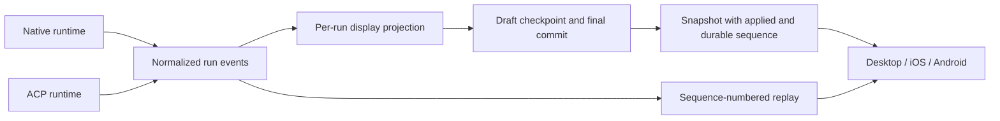

# Streaming persistence: measurements and convergence plan

## Scope and results

Measured on 2026-09-14 against origin/main `51e3301f`, with an isolated worktree
and synthetic SQLite databases. No real chat content was read, no agent calls
were made, and the running desktop backend was not restarted or modified.
This is not a production trace of the user's reported delay.

Native streaming already persists display drafts, including tool/reasoning parts.
It is incorrect to describe all paths as saving only at turn completion.
The fast `agent_state` snapshot and the UI draft are separate mechanisms.

| Synthetic turns | Display JSON | Draft write, baseline | Finalize total, baseline → worker | Event-loop stall, baseline → worker |
| --- | --- | --- | --- | --- |
| 10 | 32.5 KiB | 0.91 ms | 2.38 → 2.65 ms | 1.43 → 0.27 ms |
| 100 | 325.8 KiB | 2.47 ms | 15.19 → 15.11 ms | 14.25 → 1.65 ms |
| 500 | 1630.0 KiB | 9.94 ms | 70.55 → 72.86 ms | 69.61 → 11.05 ms |

Values are medians of five repetitions, not production percentiles. Each turn
contains a 1 KiB synthetic prompt and answer. Event-loop stall is the median of
per-repetition maximum lateness of a 1 ms asyncio heartbeat during finalization.
The experiment includes serialization, rebuilding, SQLite/FTS and state mirroring,
but excludes network/LLM time, title generation, transcript writing, concurrent
writer load and the browser. GIL-bound Python work can still stall the loop even
when run in a worker. This improves responsiveness, not total persistence latency.

Raw results: [baseline](benchmarks/persistence-baseline.json) and
[worker](benchmarks/persistence-worker.json). Reproduce from the desired source
revision with:

```sh
PYTHONPATH=src uv run python scripts/benchmark_persistence.py --output /tmp/persistence.json
```

## Reproduced defects and bounded fixes

1. `_persist_state` is async but had no awaits around synchronous serialization,
   complete history rebuilding, database finalization and mirror writing. A
   deterministic test shows another coroutine cannot run to release a blocked
   database operation. The patch runs this stage in `asyncio.to_thread`; database
   sessions are opened and closed inside the worker. Revision checks are retained.
2. Draft scheduling clears `dirty` before the write completes. An unsuccessful
   background write was swallowed without restoring `dirty`, so a forced final
   flush could skip it. Both background and forced failures now remain retryable.
   There is no automatic unbounded retry loop.

The first two regression tests failed on the baseline and pass after the patch.
Additional coverage verifies a failed forced flush can retry, and a real temporary
SQLite database exposes a native draft before the run finishes. In total, 111
focused backend tests pass (including ACP, approvals, snapshot revision guards and
postprocess jobs), along with 17 existing desktop draft/render-plan tests.
Ruff checks and formatting pass.

## Why reload can still lose visible content

- `ChatWindow.tsx` passes `showTransientAssistant` to `hideStreamingDrafts` as soon
  as the chat is streaming. That removes a saved draft even if the reconnecting
  stream contains only an unread suffix and cannot replace the earlier content.
  Existing frontend tests confirm the filtering policy, not a full browser reload
  reproduction. This is a code-supported explanation requiring an end-to-end test.
- `_DraftDisplayAccumulator.maybe_persist` is event-triggered and throttled at
  750 ms; it is not a periodic timer. Dirty content produced during the throttle
  window may wait through a long tool call until another event or final flush.
- ACP emits text through `_stream_prompt` but does not use the native draft
  accumulator. Its assistant history append occurs after the prompt returns.
- A failed draft write can worsen the gap; the retry fix above addresses this
  failure mode, but does not add cursor recovery or periodic snapshots.

## Other completion delays and observability gaps

Native streaming awaits a pending title task before leaving the generator; that
can delay outer turn cleanup. ACP appends its answer first, then awaits its title,
so the same symptom can have a different durability status. Memory extraction is
already independently scheduled and is not a required predecessor of native final
state persistence.

Native postprocessing still writes the transcript before rebuilding final display
history, and finalization reindexes the complete conversation. The desktop uses
an 800 ms delayed reload rather than a revision-specific durability acknowledgement.
Also, `_persist_state` currently logs and swallows database failures; callers can
mark the postprocess step successful. That outcome contract should be fixed with
tests alongside the unified acknowledgement, rather than interpreting logs as a
proof of persistence.

For a production diagnosis, record monotonic timings and non-content counters for:
last text delta, title wait, draft scheduled/committed/failed, snapshot commit,
display rebuild, DB/FTS commit, mirror write, and client receipt of the durable
revision. Do not log message contents, tokens, or user identifiers.

## Unified path: retain runtime adapters, share delivery and persistence



Recommended delivery order:

1. **One event envelope and lifecycle contract.** Normalize existing terminal
   variants (including ACP `AGENT_FINISHED`), assign run IDs and monotonic event
   sequences before fanout. Treat EOF as transport state, not successful completion.
2. **Snapshot + cursor recovery.** Return current projection, run state, `applied_seq`
   and `durable_seq`. Attach after the snapshot's applied sequence with atomic
   snapshot/replay handoff. Deduplicate by run/sequence, and reset on a retention
   gap. Preserve the saved draft until the replacement projection covers it.
   Never blindly concatenate a snapshot with overlapping deltas.
3. **Shared persistence coordinator.** Native and ACP feed the same projection
   and single-writer checkpoint path. Add a timer for dirty snapshots during quiet
   periods, a final flush barrier, and explicit commit/failure notifications.
   Schedule cancellation, tool approval and restart recovery against the same run.
   Keep existing revision guards; canceling an await does not stop a worker write.
4. **Short critical save path.** Persist the current turn incrementally, acknowledge
   its durable revision, then run title/index/transcript/mirror work with retries.
   Avoid multiple whole-history writes. Define index consistency and transcript
   ordering explicitly before moving these tasks independently.
5. **All clients converge.** Replace desktop consume-once/seed behavior and mobile
   full replay with the same cursor protocol, gated by server capability/version.
   Add send idempotency keys and run-status lookup; reconnect must never resend a
   user instruction merely because its acknowledgment was lost.

Acceptance tests must exercise: reload after text and during a long tool call;
interleaved snapshot and new events; desktop plus phone plus a second tab; repeated
reconnect without duplicates; database failure and retry; retention overflow;
approval suspension/resume; stop; backend restart; and a delayed title task.
Assert visible content, tool state, event sequence and durable revision, rather
than relying on sleep durations or whether a socket remains open.

These broader changes are a follow-up design, not implemented by this analysis
branch. It does not modify mobile PR #222 or fix the complete reload experience.
